# Auto Scale

```
```
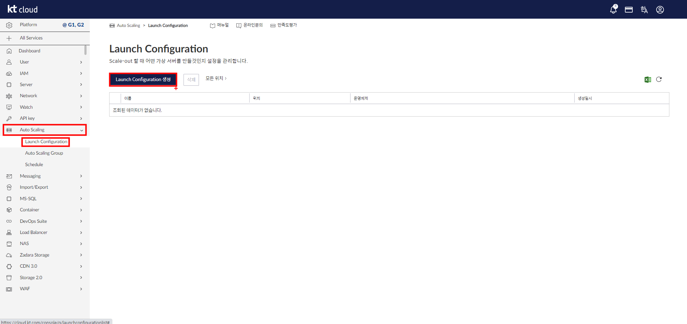

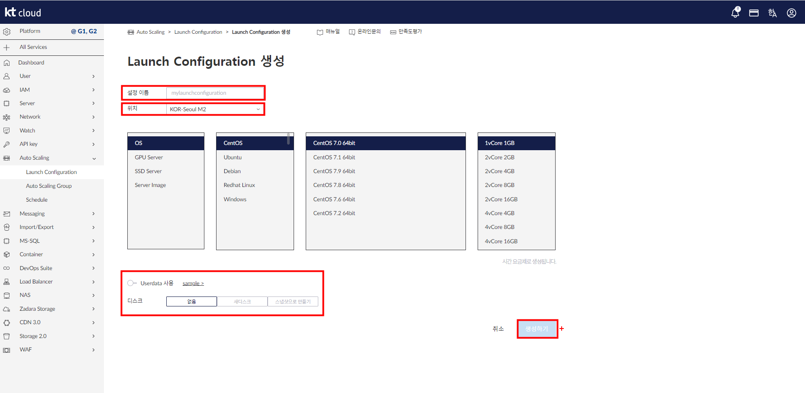

```
 설정이름 - 위치 - OS - 디스크 선택, 이때 USER DATA를 통해서 오토스케일링 그룹에 의해서 생성 되어진 서버가 시작 되면서 특정한 명령들을 실행시킬 수 있다.
```

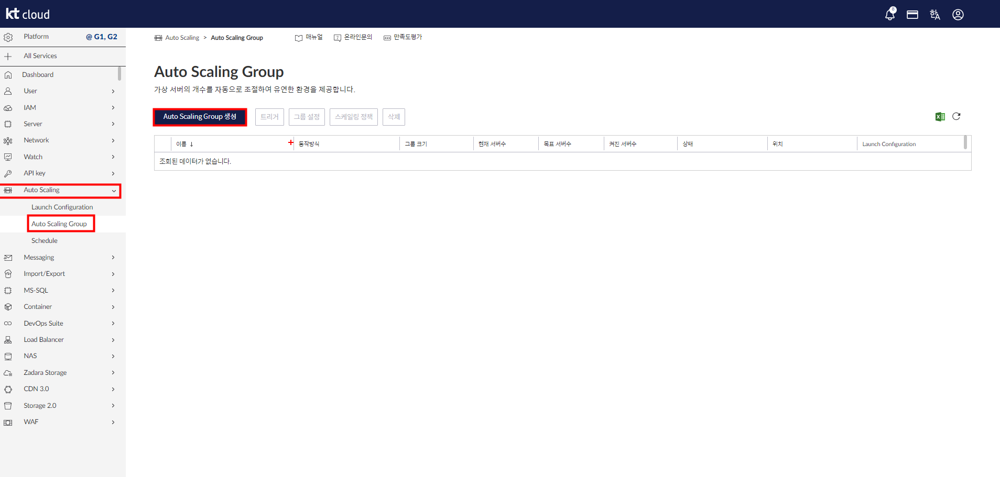

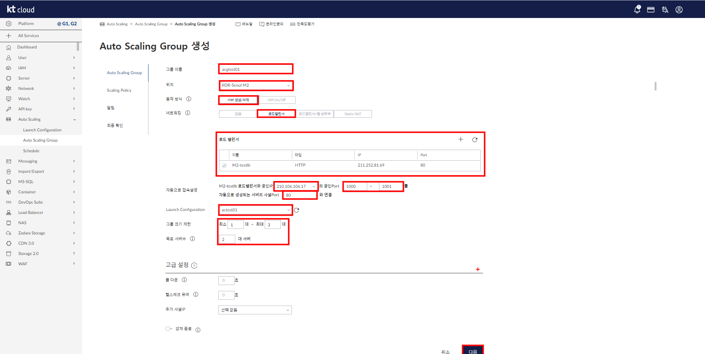

```
 빨간색 박스들은 필수로 입력 해야되는 요소들.

 사진과 같이 네트워킹을 로드밸런서로 지정했을 경우(로드밸런서가 생성되어 있다면 바로 체크가 가능하지만 만약에 없다면 + 아이콘을 눌러서 생성해야 한다.) 공인 아이피와 포트 번호 그리고 사설 포트와 연결을 설정해야 한다.

 이때 공인IP는 오토 스케일링 그룹에 의해서 생성되는 서버의 공인 IP이며 생성되는 서버의 수가 많기 때문에 포트 번호를 부여해서 해당 서버에 접속하게 된다.

 EX)

 210.106.106.17:1000 = 1번 서버
 210.106.106.17:1001 = 2번 서버
```

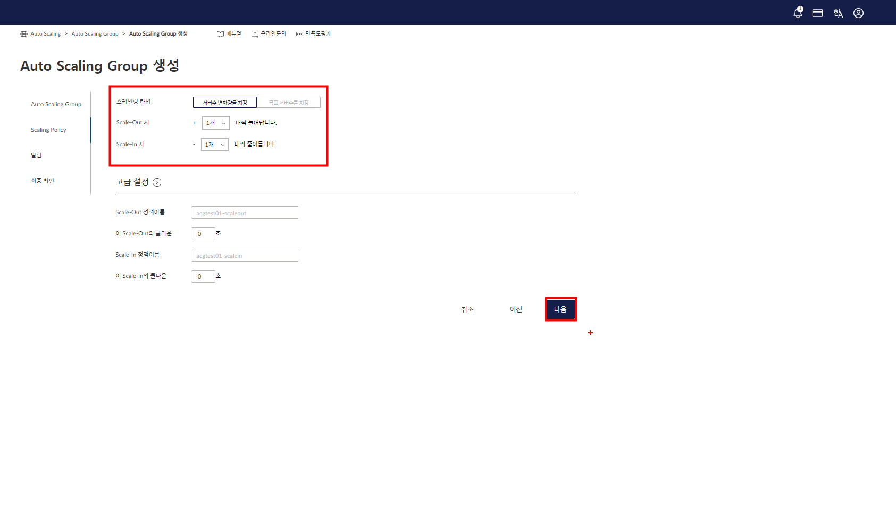

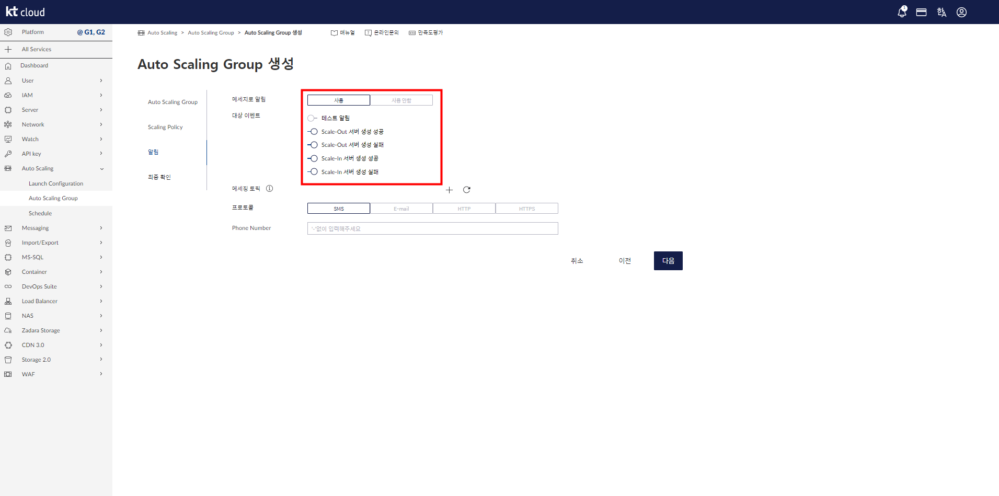

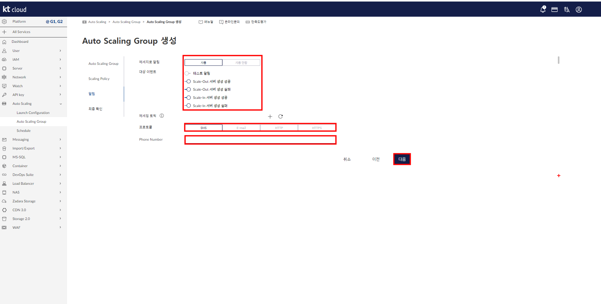

```
 알림 설정 - 대상 이벤트에서 원하는 이벤트 선택 - 전달 방법(프로토콜) 선택.
```

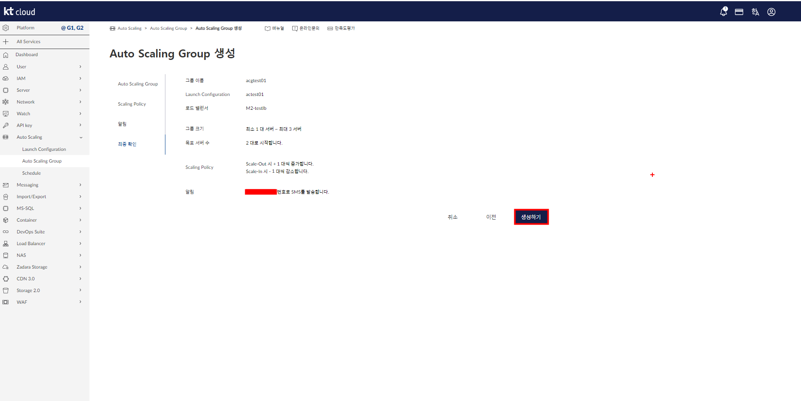

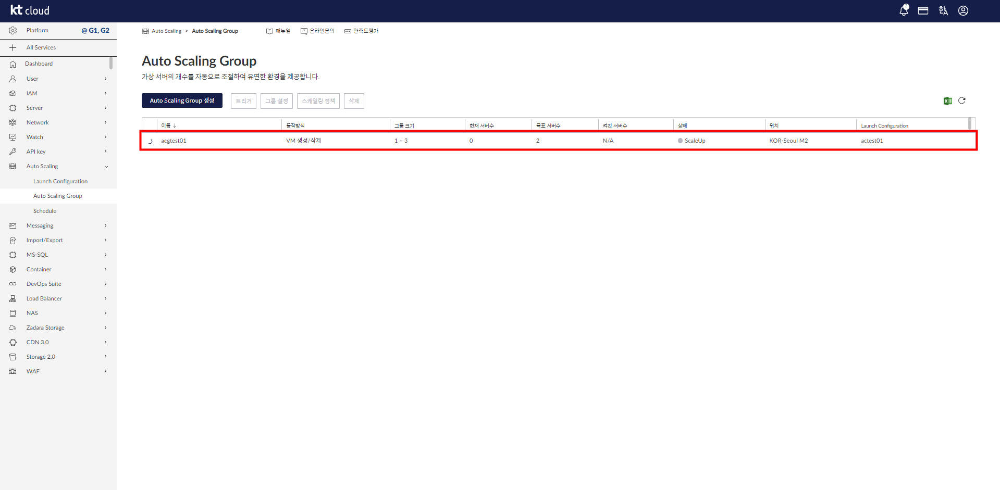

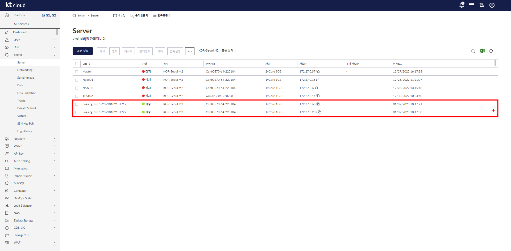

```
 오토 스케일링 그룹에 의해서 생성 된 서버 확인.
```
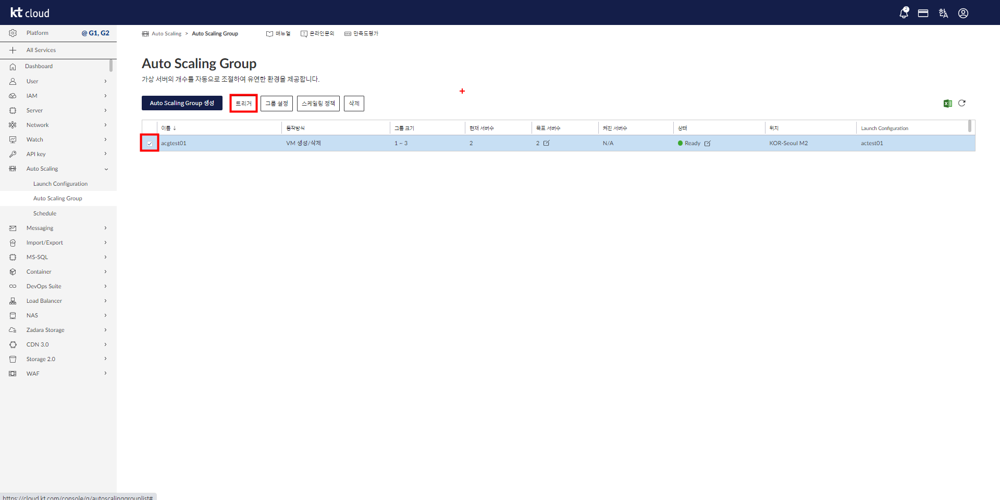

```
 KT 클라우드의 오토 스케일링은 반드시 트리서 설정이 되어 있어야 진행이 된다.
```

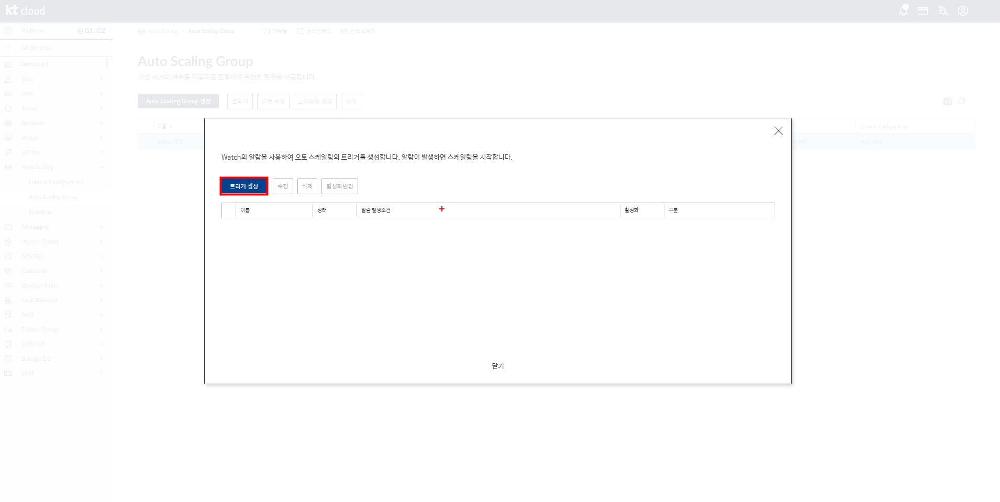

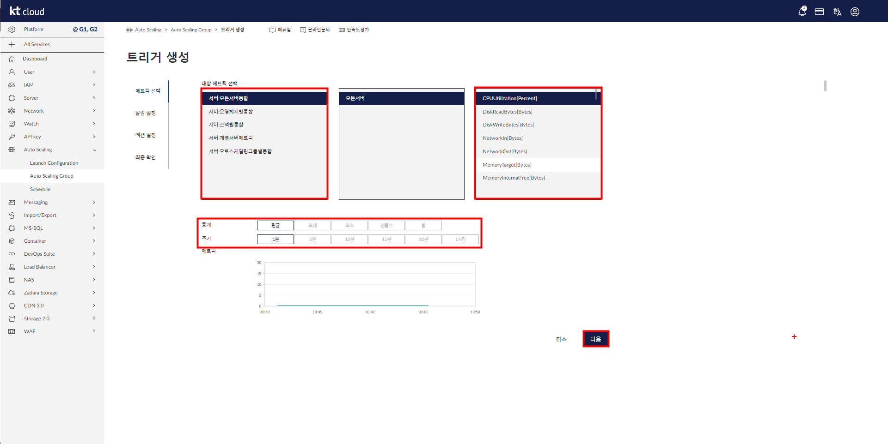

 대상 매트릭 선택(서버, OS, 스펙, 개별, 오토 스케일링 그룹별) - 기준으로 삼을 자원을 선택 - 수집 주기 선택

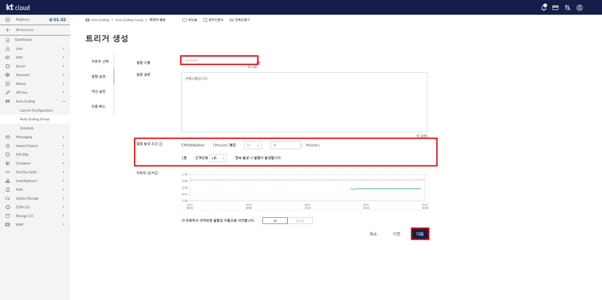

```
 알림 발생 조건 설정, 해당 조건을 기준으로 설정한 임계값을 넘어가는 경우 알람이 발생하고 서버가 생성된다.
```

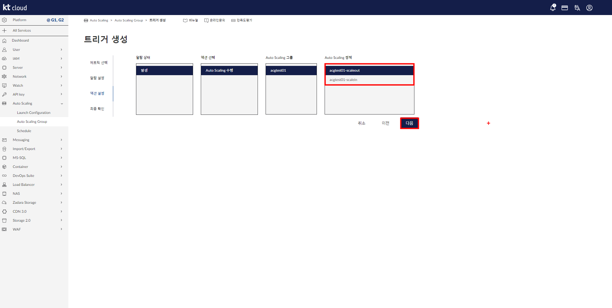

```
 정책에는 스케일 IN, 스케일 OUT 2가지가 존재.

 따라서 스케일 IN 정책, OUT 정책에 해당되는 2가지 트리거를 모두 만들어 줘야 IN/OUT이 정상 작동하게 된다.

 만약 IN만 생성 했다면 줄어 들기만 하고 생성은 안되며 OUT만 설정했다면 늘어 나기만 하고 줄어들진 않는다.
```

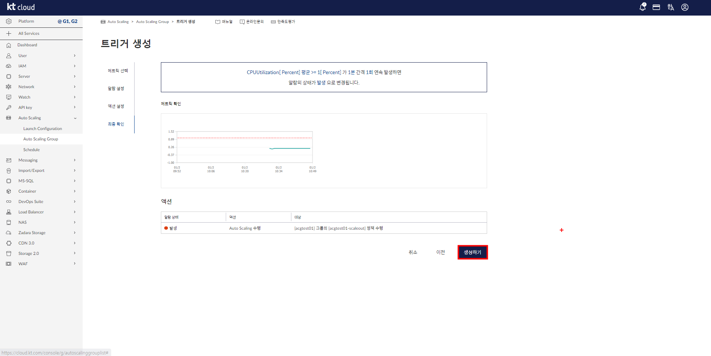


