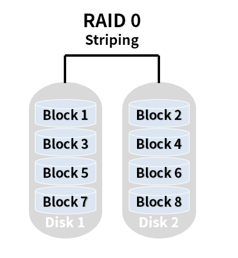
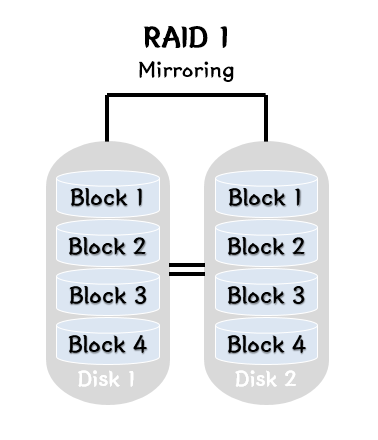

# RAID

여러 개의 하드 디스크에 일부 중복된 데이터를 나눠서 저장하는 기술,
데이터를 안전하게 보호하기 위해서 중복된 데이터를 디스크에 나눠서 저장한다. 데이터를 나누는 다양한 방법이 존재하며, 이 방법들을 레벨이라 하는데 레벨에 따라 저장장치의 신뢰성을 높이거나 전체적인 성능을 향상 시키는 등의 다양한 목적을 만족 시킬 수 있다.

RAID의 목적은 크게 세 가지

- 여러 개의 디스크 모듈을 하나의 대용량 디스크처럼 사용

- 여러 개의 디스크 모듈에 데이터를 나누어서 한꺼번에 쓰고 한꺼번에 읽는 식으로 입출력 속도 증진

- 여러 개의 디스크를 모아서 하나의 디스크로 만들고 그 중 하나 혹은 그 이상의 디스크에 장애가 나더라도 최소한 데이터가 사라지는 것은 방지

RAID에는 여러 종류에 RAID 레벨이 있는데 대표적인 RAID 구성 조합에는 0. 1, 5, 6 있다.

- RAID 0

    

    2개 이상의 디스크를 묶어서 구성하는 방식으로 데이터의 빠른 입출력을 위해 데이터를 여러 디스크에 분산 저장(DISK1, 2서로 번걸아 가면서 저장된다), 데이터 복구를 위한 추가 정보를 기록하지 않기 때문에 성능은 뛰어나지만 어느 한 디스크에서 장애가 발생하면 데이터는 모두 손실 된다는 단점이 있다 (실제로 RAID 0 만으로 구성된 서버나 스토리지는 거의 없다)

- RAID 1

    
    
    Raid 1은 Mirror 구성 또는 Shadowing이라고 해서 빠른 기록 속도와 함께 장애 복구 능력이 요구되는 경우에 많이 사용, 최소 2개의 디스크로 구성된다. 
    
    Raid 1은 디스크 장애를 대비하여 백업 용으로 다른 하나의 디스크를 동일하게 구성한다.
    
    RAID 1 은 한 디스크에 기록되는 모든 데이터를 다른 디스크에 복사해 놓는 방법으로 복구 능력을 제공하며 하나의 디스크를 사용하는 것보다 약간 나은 정도의 성능을 제공한다. 단, 읽을 때는 조금 빠른 속도를 제공하지만 저장할 때는 속도가 약간 느려지기도 한다.
    
    두 개의 디스크에 데이터가 동일하게 기록되므로 데이터의 복구 능력은 높지만 전체 용량의 절반이 여분의 데이터를 기록하기 위해 사용되기 때문에 저장 용량 당 단가가 비싸다

- RAID 5

    

    RAID 5 는 패리티 정보를 모든 디스크에 나눠 기록합니다. 
    
    패리티란? 디스크 장애 시 데이터를 재 구축하는데 사용할 수 있는 사전에 계산된 값으로 디스크의 4개 블록 중 3개는 데이터를 저장하는데 쓰고 나머지 하나는 패리티 영역으로 두어 오류를 검출,디스크 하나가 장애가 날 경우 해당 영역를 이용해서 장애 난 디스크의 데이터를 복구해낸다.
    
    따라서 문제가 발생할 경우, 컨트롤러 가 정상적으로 운영되고 있는 다른 디스크로부터 손실 된 데이터를 가져와 복구/재생한다.
    
    패리티를 담당하는 디스크가 병목 현상을 일으키지 않기 때문에 RAID 5는 Multi 프로세스 시스템과 같이 작은 데이터 기록이 수시로 발생할 경우 속도가 더 빠르지만 읽기 작업일 경우 각 드라이브에서 패리티 정보를 건너뛰어야 하기 때문에 조금 느릴 수 있다.
     
    디스크는 최소 3개, 일반적으로는 5개 이상 필요하다.

- RAID 6 

    

    RAID6는 RAID5 와 비슷하며 최대 2개까지 장애가 나더라도 데이터의 손실이 발생하지 않는다. 하지만 패리티가 2개이다 보니 장애가 난 디스크와의 동기화가 RAID5보다는 느리다. 
    
    Disk는 최소 4개가 필요하다.

- RAID 0+1 ( Stripping & Mirroring )

    
    
    RAID 0+1 은 RAID 0 의 빠른 속도와 RAID 1 의 안정적인 복구 기능을 합쳐 놓은 방식으로 최소 4개의 디스크로 구성된다. 
    
    데이터가 입력되면 Striping 방식으로 두 개 이상의 디스크에 나눠서 저장, 동시에 같은 형태로 다른 하드디스크에도 동일하게 저장된다.

    Striping이란? 디스크 하나가 Block 으로 이루어져 있는데, 이러한 Block들을 Strips 라고 하며 이러한 Strips의 집합을 Stripe 라고 한다.
    
    Striping은 데이터를 물리적인 디스크에게 넓게 퍼뜨리며 읽기/쓰기를 가능하게 하는 것을 말한다. 
    
    4개의 디스크로 RAID 0 + 1 구성하면 2개의 디스크로 Striping 할 때와 같은 쓰기 속도가 나오며 읽기 속도는 4개의 디스크에서 나눠서 읽어오기 때문에 보다 빠른 속도를 갖게 된다.
    
    그리고 Mirroring 으로 똑같은 디스크 복사본(Hot spare) 을 갖고 있기 때문에 장애가 발생했을 때도 완벽한 복구가 가능하다는 장점이 있다. (단, 전체 용량의 50%만 사용이 가능하다.)