# Github.io

 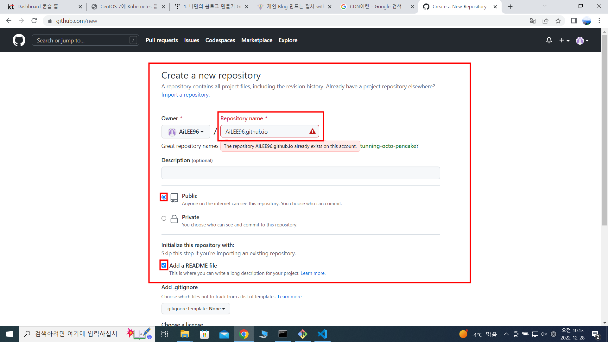
 
 ```
 깃허브 레포지터리를 새롭게 생성, 이때 레포지터리의 명칭은 [사용자의 이름].github.io 이어야 한다.
 ```

 

 ```
 깃허브 데스크톱을 이용해서 추가 된 레포지터리를 확인.
 ```

 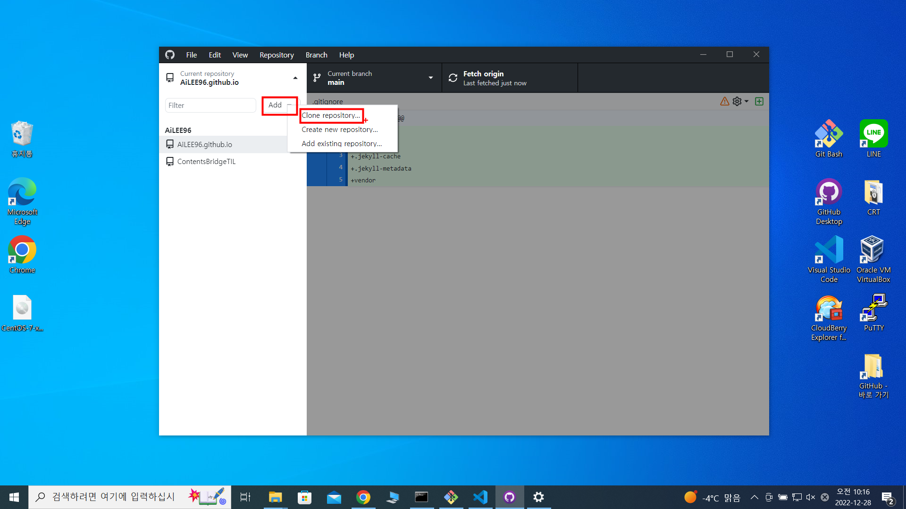

 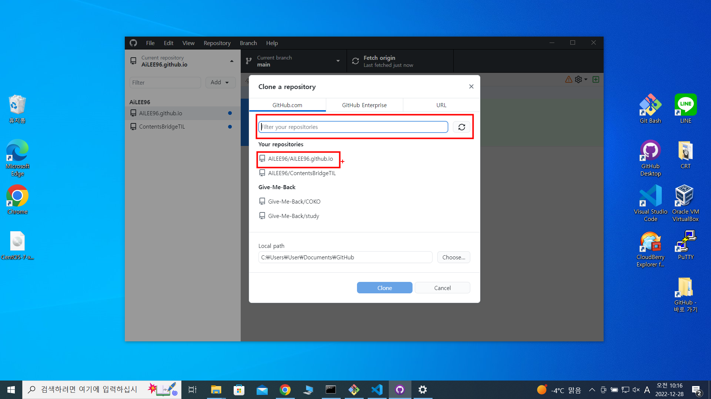

 ```
 생성되어 있는 레포지터리를 클론.
 ```

 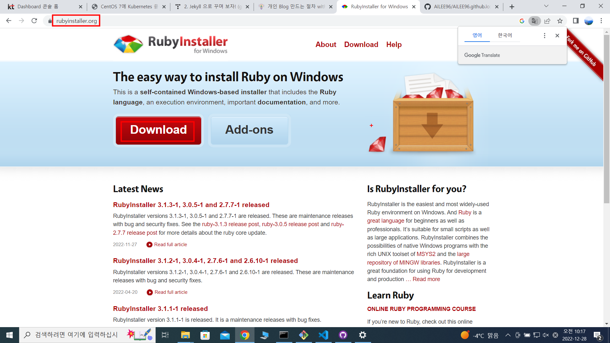

 ```
 Github.io를 이용하기 위해선 윈도우에 Ruby가 설치되어 있어야 함으로 Ruby 설치.
 ```

 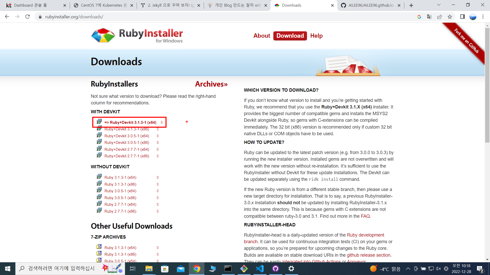

 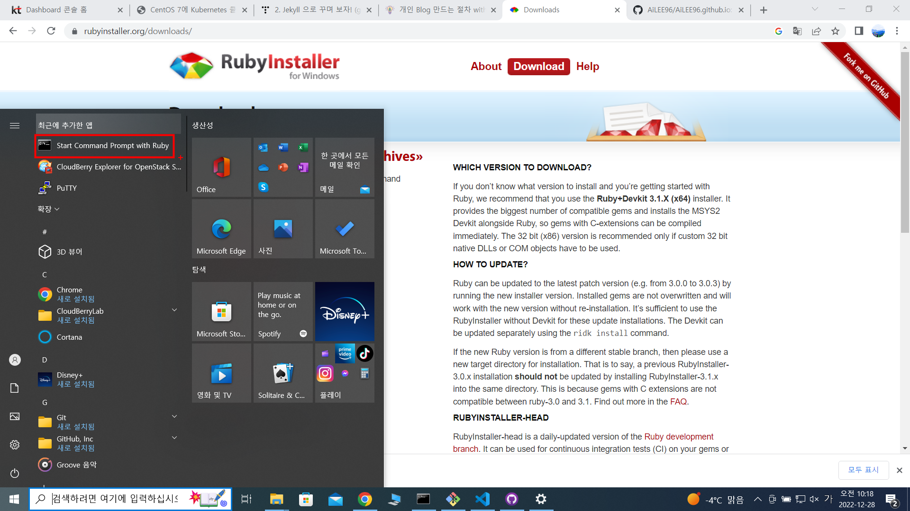

 ```
 Ruby가 정상적으로 설치되었다면 Start Command prompt with Ruby를 볼 수 있다.
 ```

 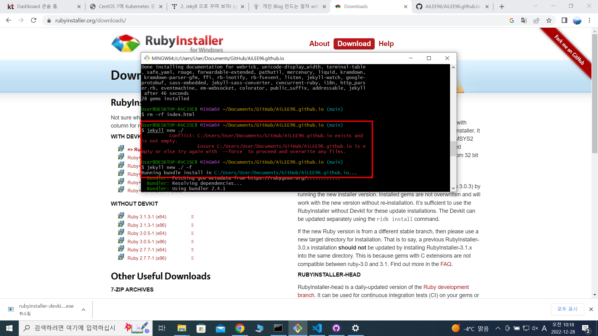

 ```
 깃허브 데스크탑으로 레포지터리를 추가 시켰다면 보통 내 PC - 내 문서 - Github - [추가한 레포지터리]가 등록되어 있다. 이렇게 추가가 된 레포지터리에서 Git bash를 실행.

 gem install bundler 
 gem install jekyll
 ```
 
 원격 저장소에 연결된 루트 디렉터리에 추가해야 함으로 아래와 같은 명령어를 입력.

 ```
 jekyll new ./

 이때 사진과 같은 오류가 출력된다면 -f 명령어의 부재 때문에 그렇다.

 jekyll new ./ -f

 -f, flag는 --force의 약자로 해당 디렉토리가 비어 있지 않기 때문에 주는 옵션이다. 
 
 ```
 
 ```
 bundler install
 bundle exec jekyll serve
 http://127.0.0.1:4000/
 ```
 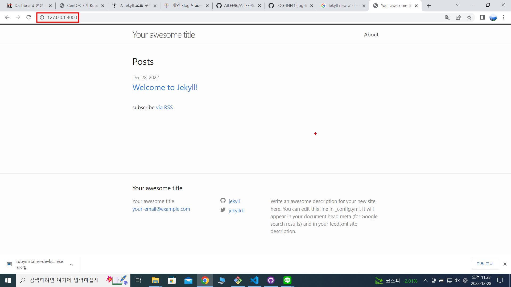

 페이지가 정상적으로 출력된다. 테스트가 끝난 파일들을 그대로 깃허브에 업로드.

 

 사진과 같이 업로드가 끝나게 되면 아래처럼 github.io가 정상적으로 동작한다. 

 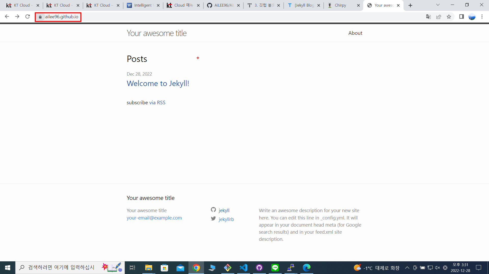

# Github.io theme

 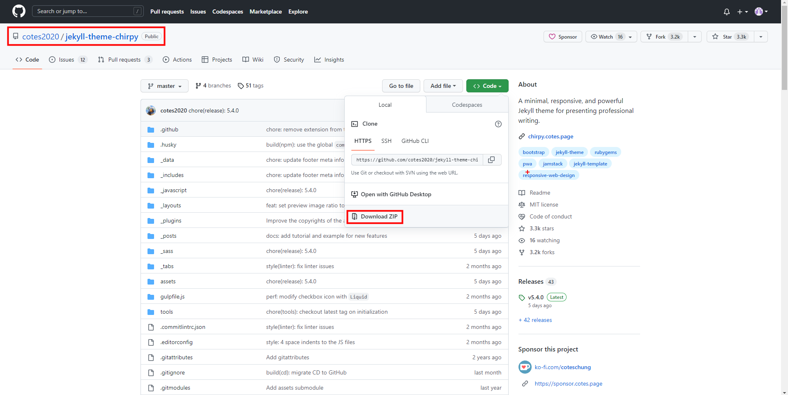

```
 원하는 Io theme 서치.

 구글에 무료 테마를 검색해서 jekyll-theme-chirpy라는 마음에 드는 테마를 발견.

 Zip 다운로드 - 압축 해제 - 해제한 파일을 통째로 [내 아이디].github.io 레포지터리에 붙여넣기.

 이때 겹치는 파일들은 전부다 덮어쓰기를 진행
```

 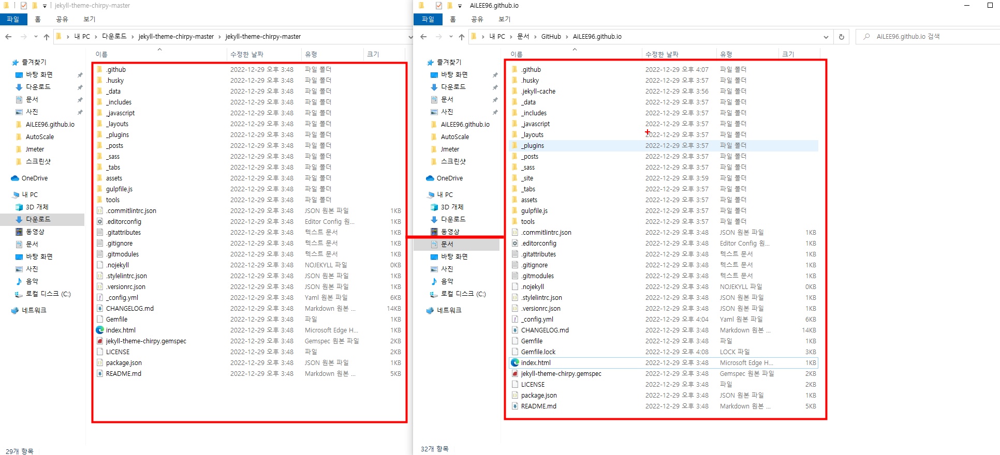

 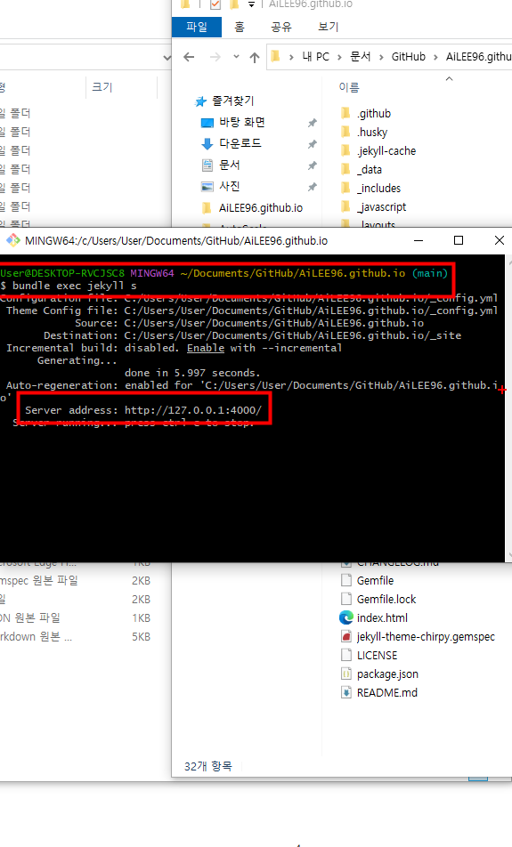

 ```
 bundle exec jekyll s

 명령어를 입력해서 실행, 실행 시 나오는 주소를 입력해서 페이지가 제대로 출력되는지 확인
 ```

 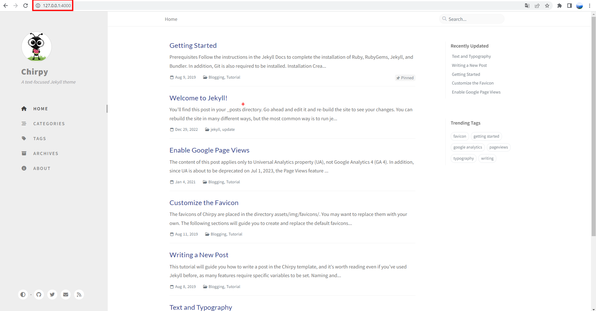

  ```
 내 로컬에서 업로드가 제대로 되는걸 확인 했다면 익숙한 절차를 다시 한 번 진행.

 git add - commint - push
  ```

 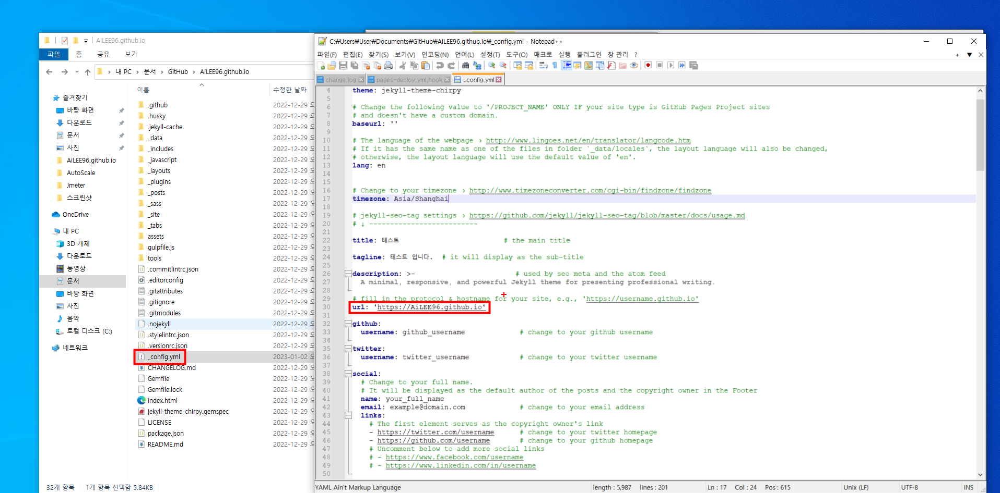

 ```
 그 전에 꼭 _config.yaml에 url을 설정해주자.
 ```

