# WAF

```
웹방화벽은 웹서버 앞에 위치하여 외부로부터 들어오는 HTTP/HTTPS 트래픽을 감시하여 웹 애플리케이션에 대한 악의적인 공격이 탐지되면 해당 공격이 웹 서버에 도달하기 전에 차단하는 역할을 수행한다.

웹방화벽은 방화벽에서 걸러주지 못하는 응용계층의 위험한 유해 트래픽을 웹 서버에 도달하지 못하도록 근본적으로 차단하는게 WAF의 역할.
```

```
WAF 설정을 하기에 앞서서 기본적으로 WAF 연동을 진행 할 서버 2대와 로드밸런서가 있다고 가정하고 시작한다.
```

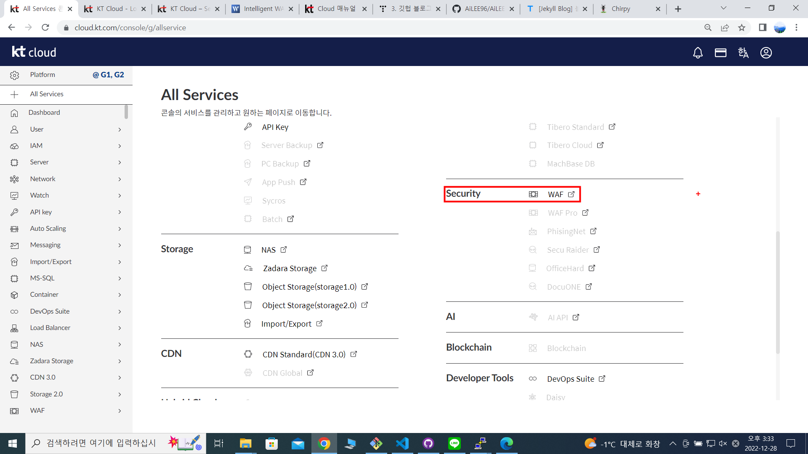

```
WAF 서비스 신청
```

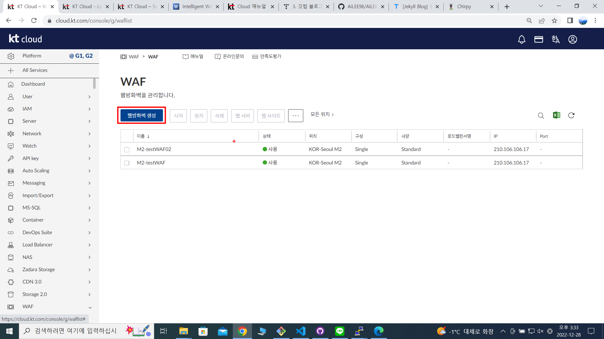

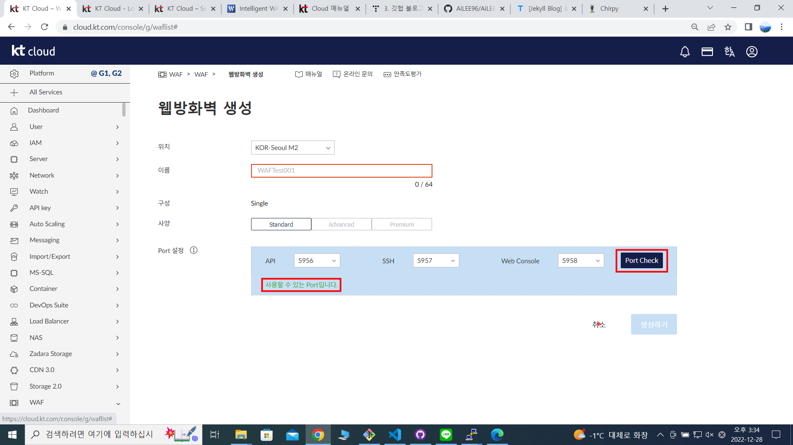

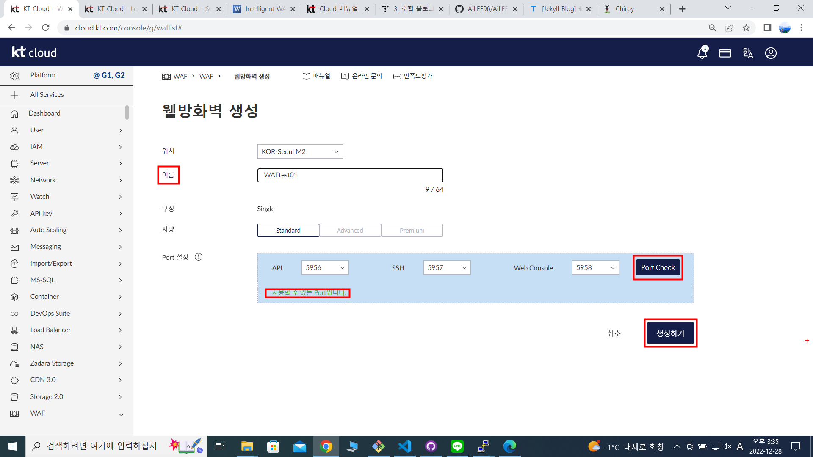

```
이름, 포트 체크, 생성 완료
```

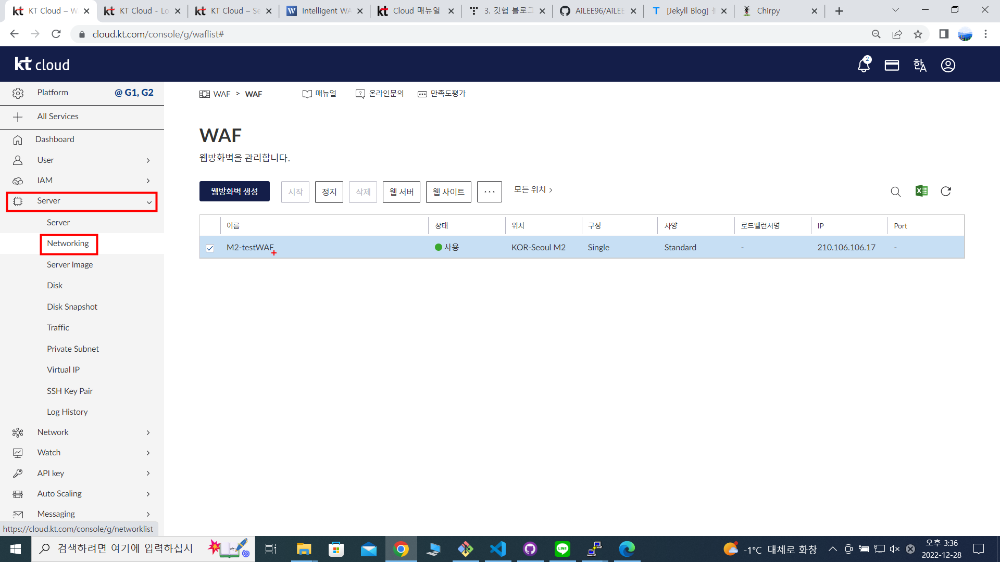

```
서버 - 네트워크로 이동
```

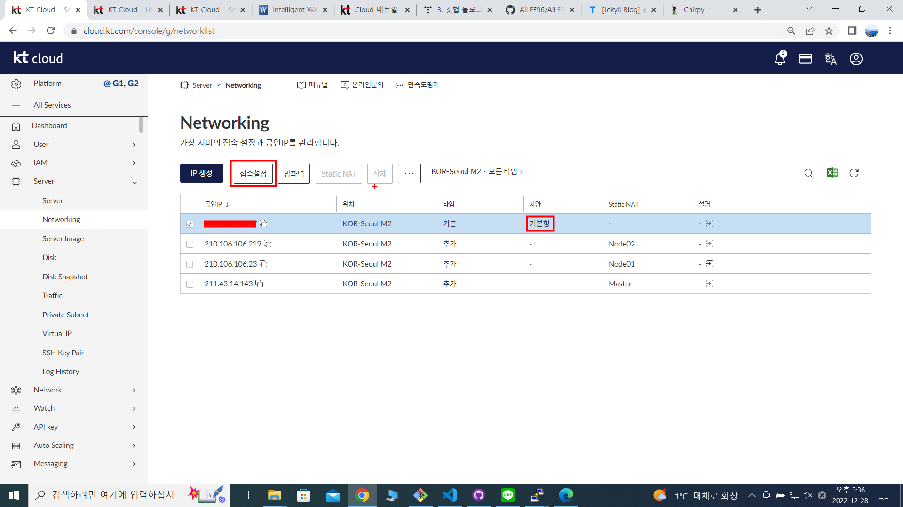

```
WAF는 기본 네트워크의 설정 됨으로 기본 네트워크 - 접속 설정 - 포트 등록(포트 포워딩)이 이뤄저야 한다.
```

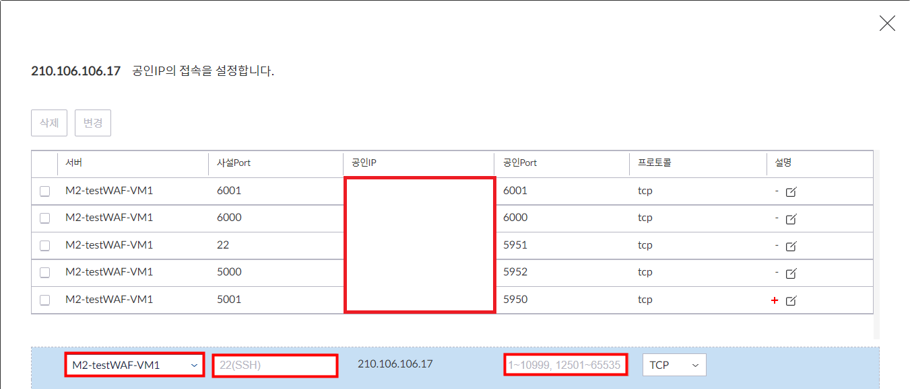

```
WAF 선택, 추가한 포트 등록(6000-6000, 6001-6001)
```
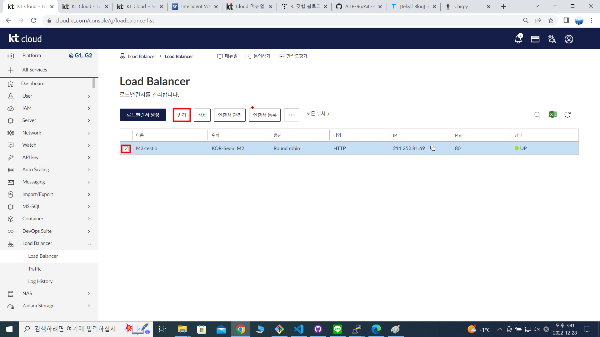

```
로드밸런서 - 변경
```
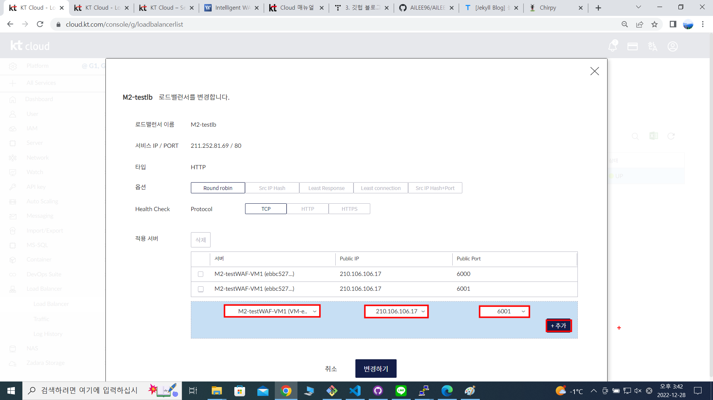

```
설정 된 두개의 서버가 로드밸런서의 연결되어 있었음으로 기존의 로드밸런서의 등록되어 있던 서버 2개를 해제하고 WAF와 추가 할 포트를 선택, 아까 전 기본네트워크에 포트 포워딩 해놓은 6000, 6001번을 추가.
```

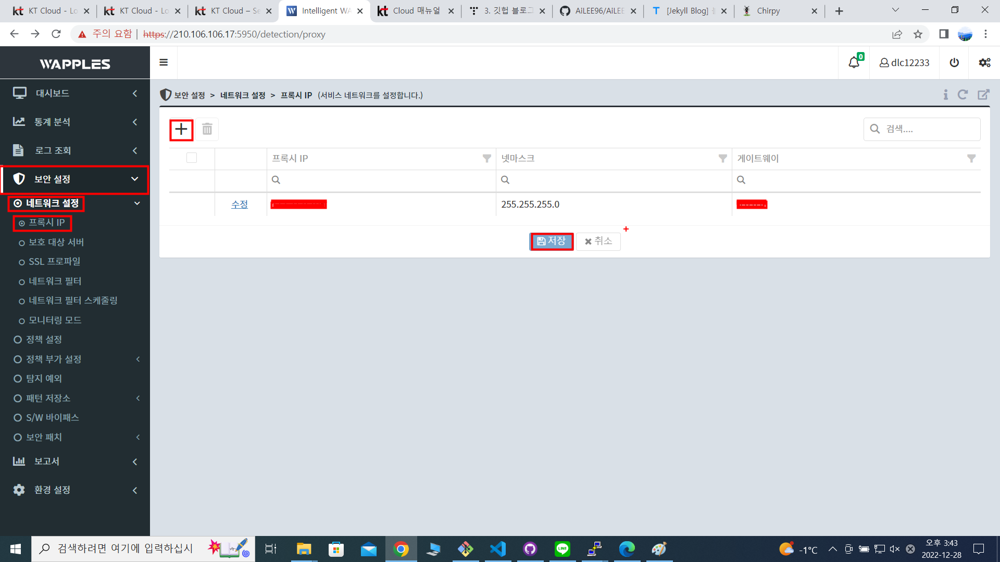

```
WAF 콘솔에 접속한 장면

1. WAF 콘솔에 접속하기 위해선 WAF 체크 박스 체크 - ... 클릭 - 콘솔 접속 - 아이디 및 패스워드 입력.

2. WAF 첫 시작 시 시간 동기화 진행.

3. 보안설정 - 네트워크 설정 - 프록시 IP.


```

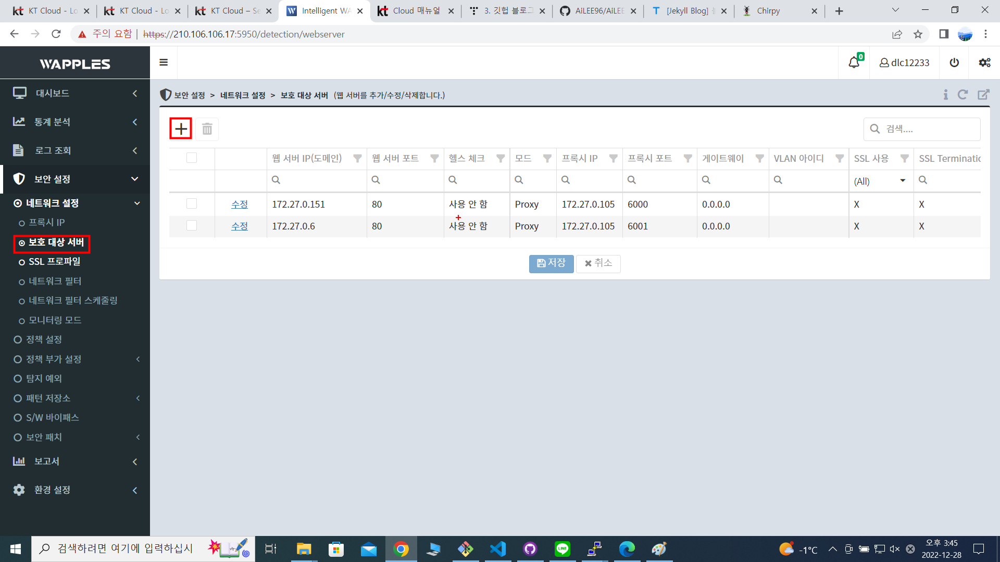

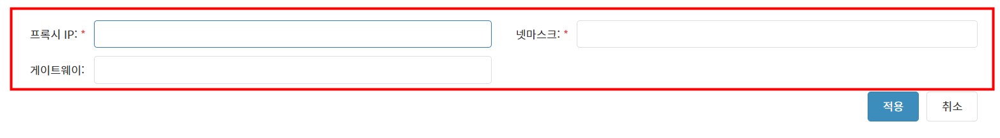

```
프록시 IP는 생성된 WAF의 사설 IP를 의미하며 넷마스크, 게이트웨이는 회사 또는 개인 사정의 알맞게 입력.

프록시 IP : WAF의 사설 IP
넷마스크 : 255.255.255.0
게이트웨이 : 0.0.0.0
```

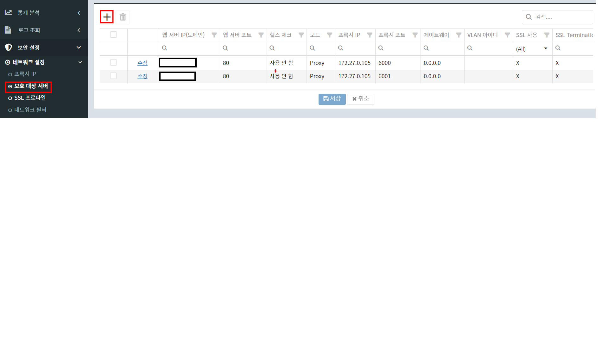

```
프록시 IP 추가 설정이 끝났으면 보호 대상 서버 이동
```
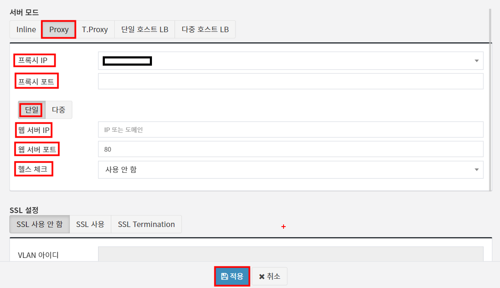

```
프록시 IP : WAF의 사설IP(아까 전 추가)
프록시 포트 : 6000, 6001

웹 서버 IP : 웹 서버가 실행되고 있는 IP
웹 서버 포트 : 웹 포트번호

적용.

```

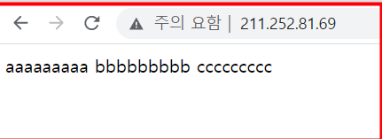

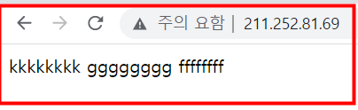

```
모든 설정을 완료하고 로드밸런서의 주소를 입력해보면 정상적으로 작동하고 있음을 알 수 있다.
```


